# Fractal Path Tracer

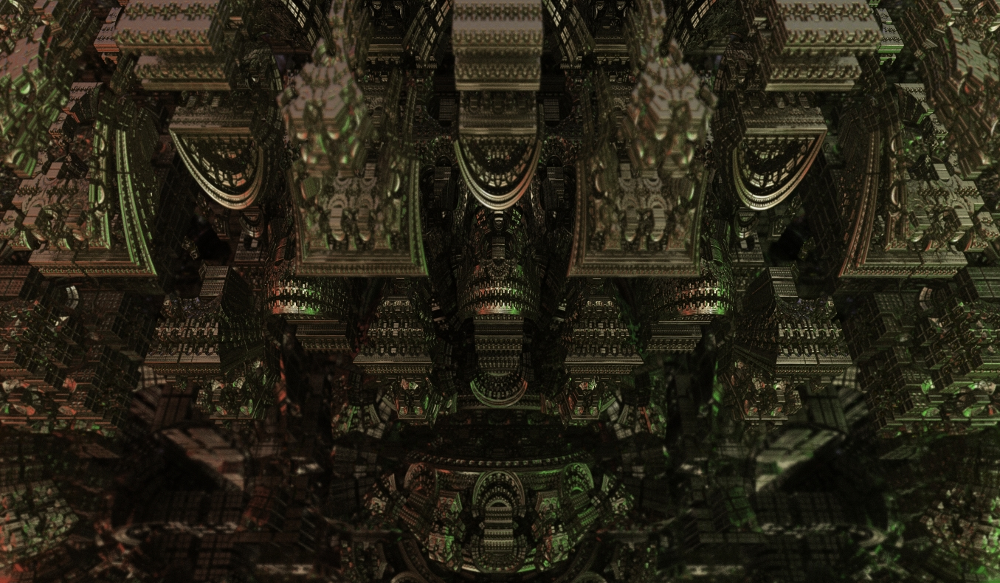
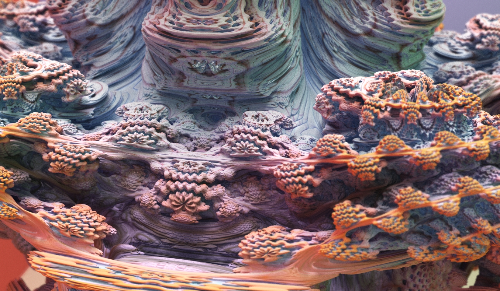

## Features

* Path Tracing (Next Event Estimation)
* Distance Estimation (Mandelbox, Mandelbulb)
* Diffuse, Specular, Refraction
* Anti Aliasing (Stratified Sampling)
* Depth of Field

## Requirements

* GLSL 4.6
* Shader Toy v0.10.15 (Visual Studio Code Extension)

## WebGL Demo

GeForce GTX 1080 or higher recommended.

* [Cornell box](https://takah29.github.io/fractal-path-tracer/main_cornellbox.html)
* [Mandelbox](https://takah29.github.io/fractal-path-tracer/main_mandelbox.html)
* [Mandelbulb](https://takah29.github.io/fractal-path-tracer/main_mandelbulb.html)

## Screenshots

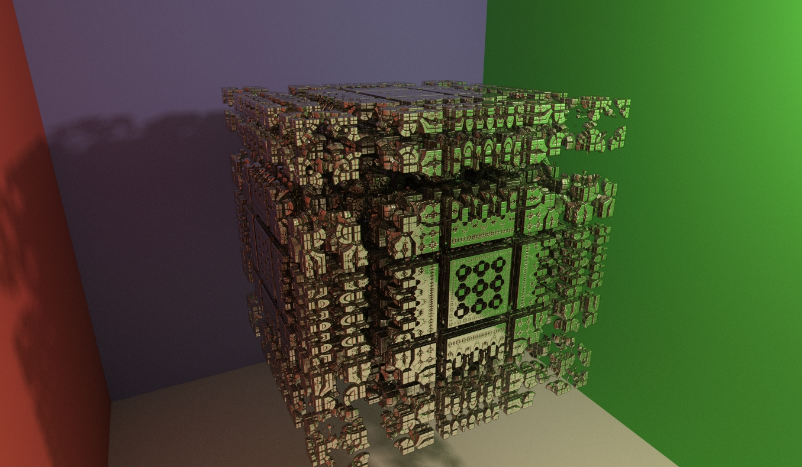
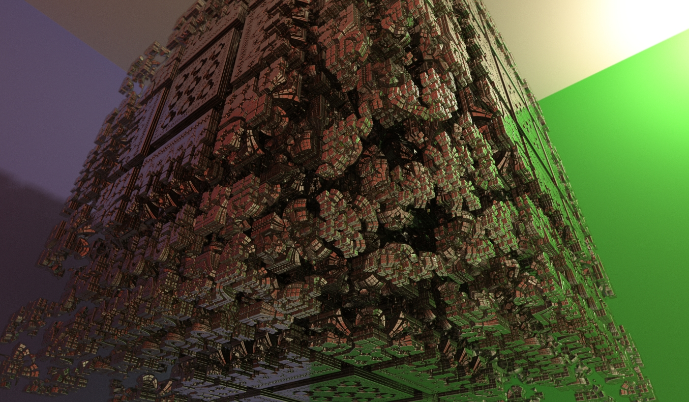
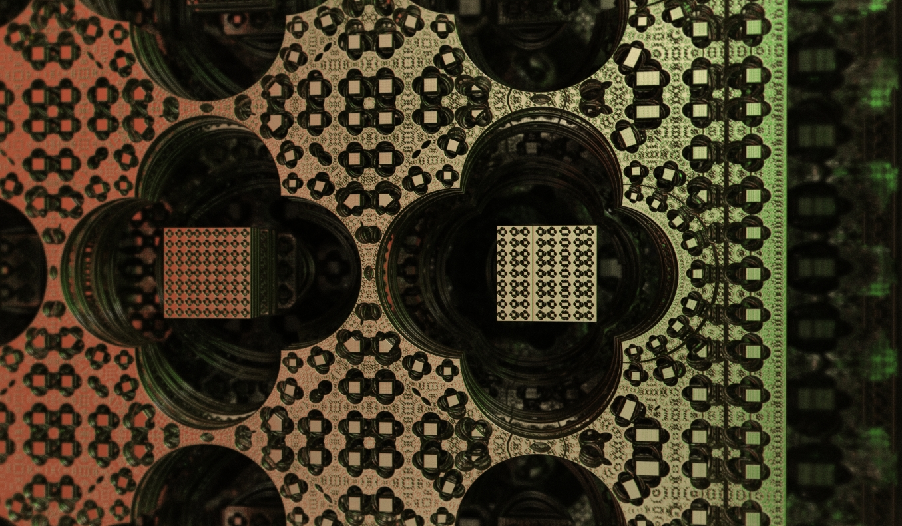
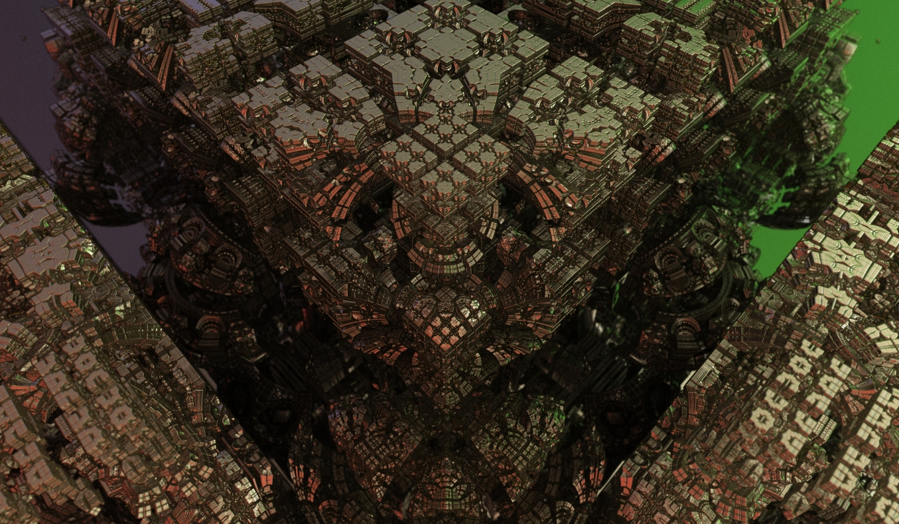
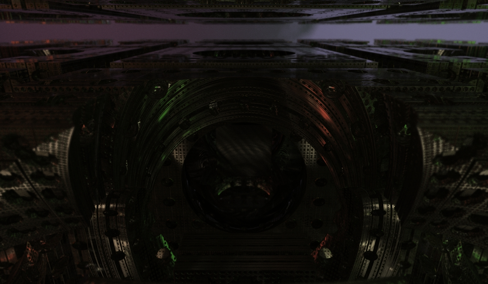
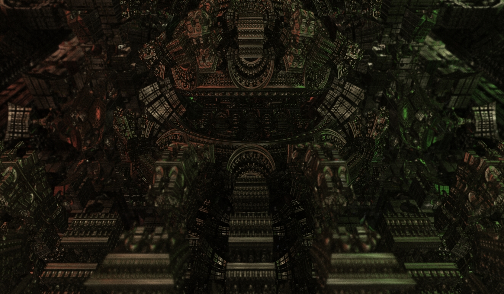
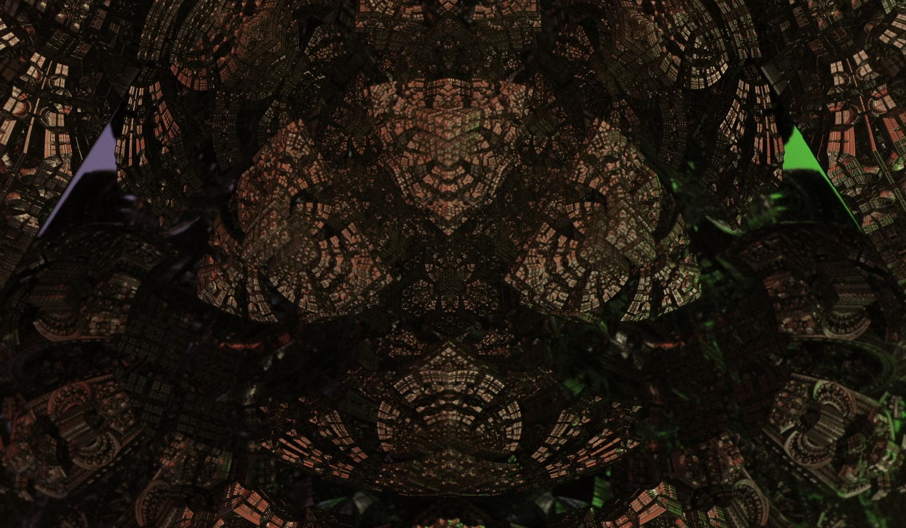
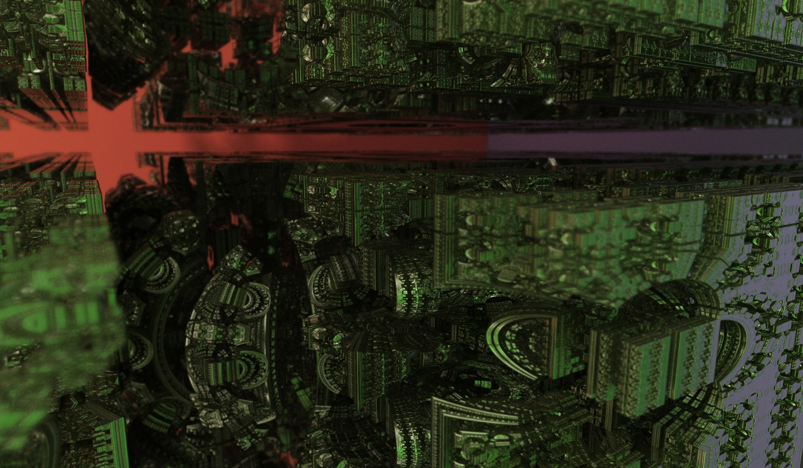
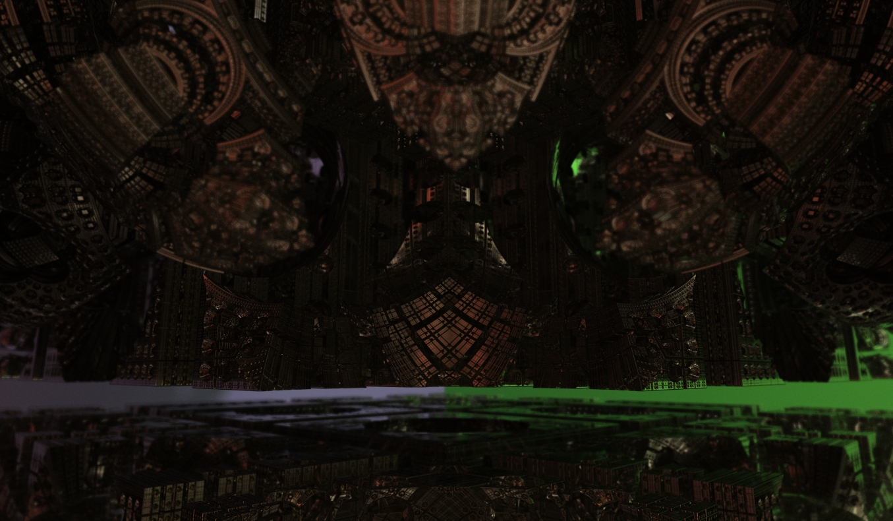
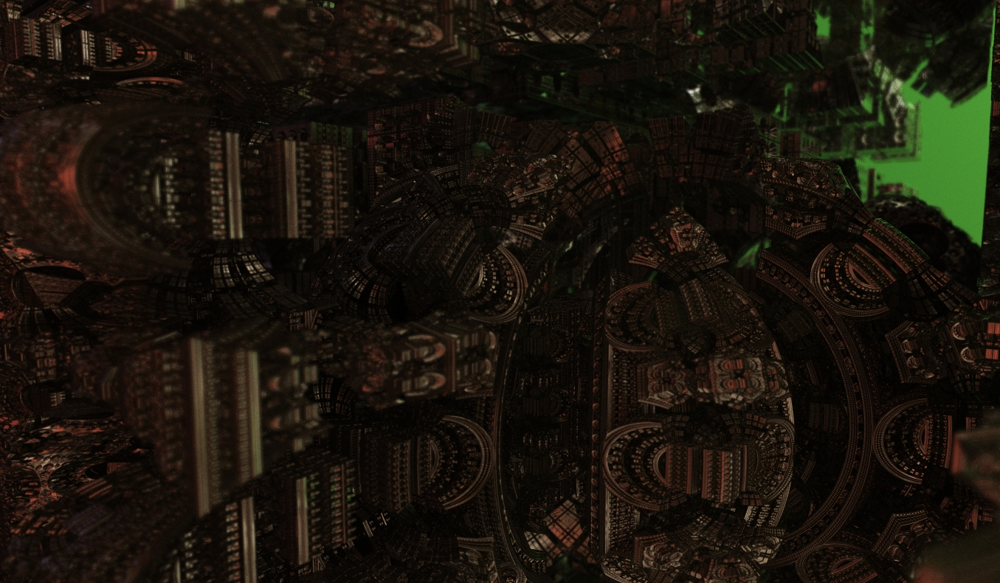
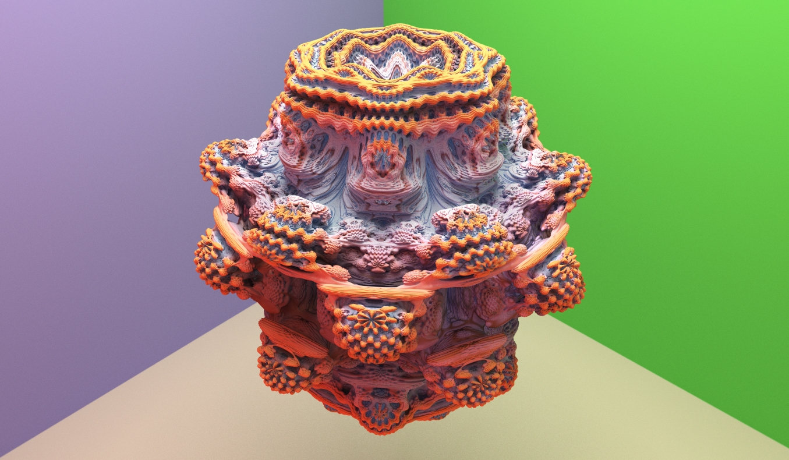
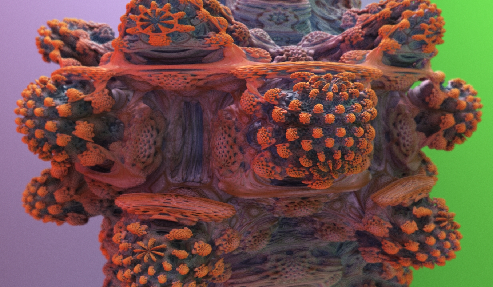
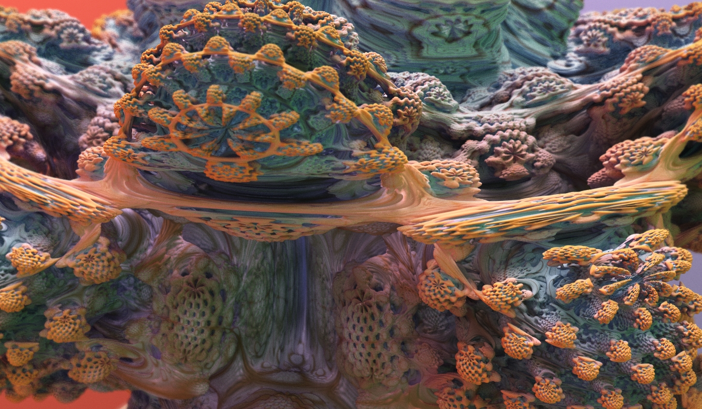
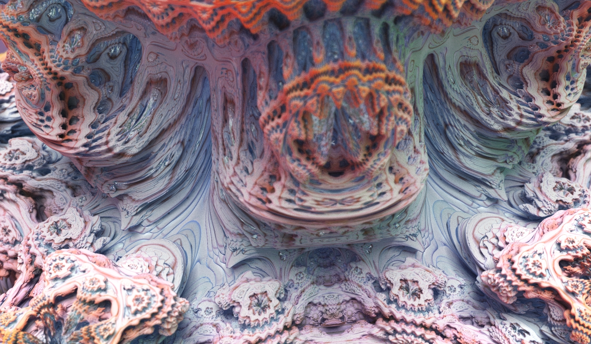
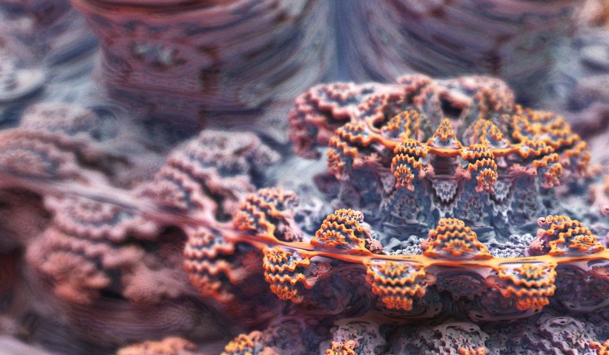
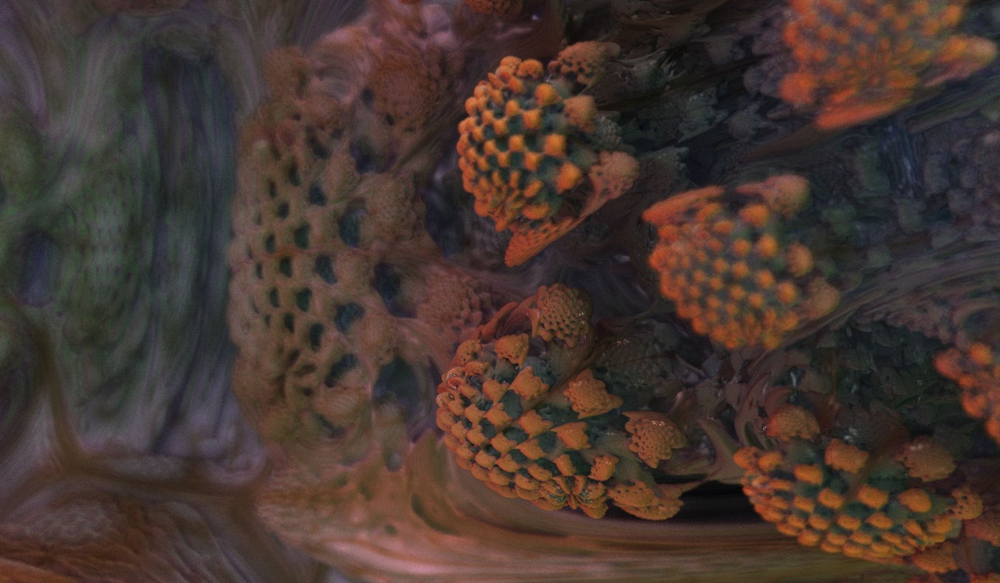

## References

* [Shadertoy](https://www.shadertoy.com/)
